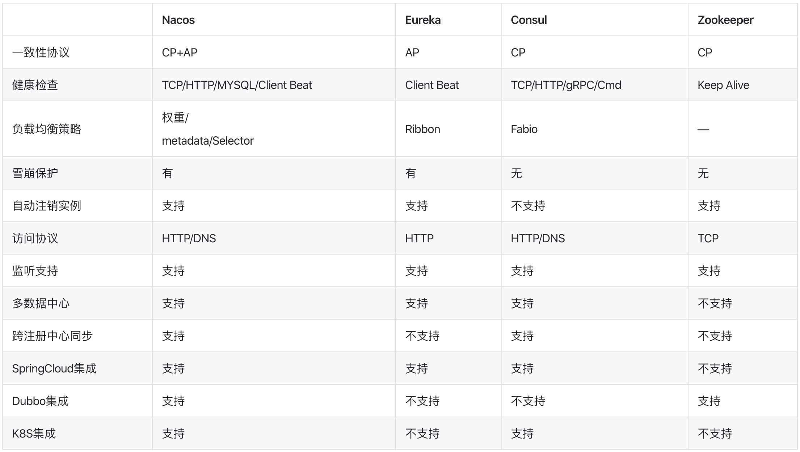
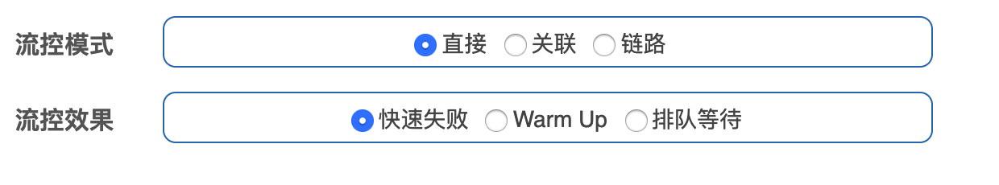
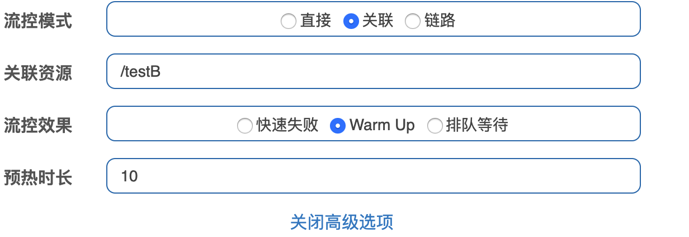
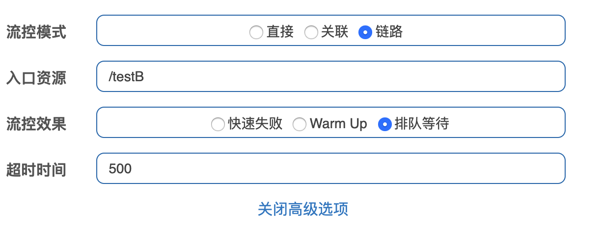
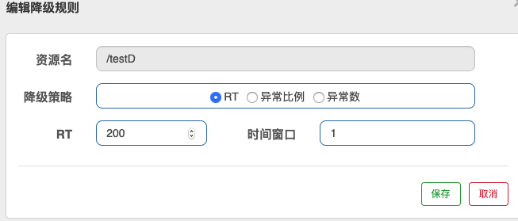
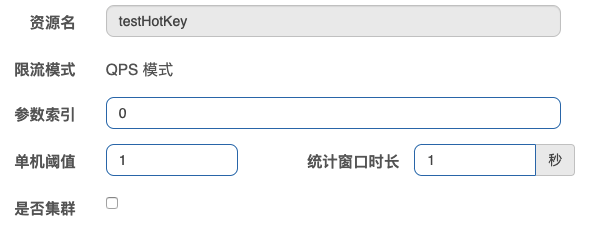
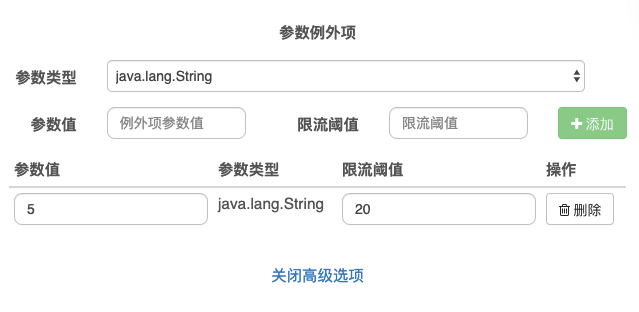

# Spring Cloud

## 1.Spring Cloud Overview
- micro service tech stack
- Eureka，Zuul in maintenance mode，Nacos including service registration and config

***

## 2. Project Structure
```groovy
subprojects {
    apply plugin: 'java'
    apply plugin: 'org.springframework.boot'
    apply plugin:'io.spring.dependency-management'

    sourceCompatibility = 1.8
    targetCompatibility = 1.8

    [compileJava,compileTestJava,javadoc]*.options*.encoding = 'UTF-8'
    repositories {
        mavenLocal()
        mavenCentral()
    }
    ext {
            springBootVersion = '2.2.6.RELEASE'
            springCloudAlibabaVersion = '2.1.0.RELEASE'
            springCloudVersion = 'Honton.SR1'
    }

    dependencies {
        implementation "org.springframework.boot:spring-boot-starter-web:$springBootVersion"
        implementation "org.springframework.cloud:spring-cloud-dependencies:$springCloudVersion"
        implementation "org.springframework.cloud:spring-cloud-alibaba-dependencies:$springCloudAlibabaVersion"
        annotationProcessor "org.springframework.boot:spring-boot-configuration-processor"
        implementation "org.mybatis.spring.boot:mybatis-spring-boot-starter:2.0.0"
        implementation "com.alibaba:druid:1.1.16"
        runtime "mysql:mysql-connector-java"
        implementation "log4j:log4j:1.2.17"
        testCompile "junit:junit:4.12"
        testCompile "org.springframework.boot:spring-boot-starter-test:$springBootVersion"
        compileOnly 'org.projectlombok:lombok'
        annotationProcessor 'org.projectlombok:lombok'
    }
}
```
***

## 3. RestTemplate
- spring wrapper http client to invoke remote restful
- passing url, parameter and return type
- configure RestTemplate
```java
@Configuration
public class ApplicationContextConfig {

    @Bean
    public RestTemplate getRestTemplate() {
        return new RestTemplate();
    }
}
```
- call RestTemplate for http call
```java
public class OrderController {
    public static final String PAYMENT_URL = "http://localhost:8001";
    @GetMapping("/consumer/payment/create")
    public CommonResult<Payment> create(Payment payment) {
        return restTemplate.postForObject(PAYMENT_URL + "/payment/create", payment, CommonResult.class);
    }
}
```
***


## 4. Common 
- abstract common code
- enable jar and maven
- reuse maven local repo to install to local
```groovy
plugins {
    id 'java'
    id 'maven'
}
jar.enabled = true

repositories {
    mavenLocal()
    mavenCentral()
}
```
- other project import module
```groovy
dependencies {
    implementation "com.bp:cloud-api-common:1.0"
    testCompile group: 'junit', name: 'junit', version: '4.12'
}
```


## 5. Service Discovery
#### Eureka
- client-server architecture with heart beat
- service provider cluster register to eureka server cluster
- service consumer get registry from eureka server cluster
- eureka server: provide registration service
- eureka client: register service, heart beat period is 30s, de-register client if no heart beat
- server
    + configuration in buidl.gradle and application.yml
    + enable in main application
```groovy
implementation "org.springframework.cloud:spring-cloud-starter-netflix-eureka-server:2.2.1.RELEASE"
```
```yaml
eureka:
  instance:
    hostname: localhost
  client:
    # do not register self
    register-with-eureka: false
    # declare as register
    fetch-registry: false
    # url to qurey to lookup service
    service-url:
      defaultZone: http://${eureka.instance.hostname}:${server.port}/eureka
```
```java
@EnableEurekaServer
public class EurekaMain7001 { }
```
- client
    + configuration, spring.application.name is service in registry
    + enable in main application
```groovy
implementation "org.springframework.cloud:spring-cloud-starter-netflix-eureka-client:2.2.1.RELEASE"
```
```yaml
eureka:
  client:
    register-with-eureka: true
    fetch-registry: true
    service-url:
      defaultZone: http://localhost:7001/eureka
```
```java
@EnableEurekaClient
public class PaymentMain8001 { }
```
- cluster
    + eureka server register with each other
    + eureka client register to multiple eureka server
        + enable @LoadBalanced for RestTemplate
        + change the hostname to service name
```yaml
eureka:
  instance:
    hostname: eureka7001.com
  client:
    service-url:
      defaultZone: http://eureka7002.com:7002/eureka
```
```yaml
eureka:
  instance:
    hostname: eureka7002.com
  client:
    service-url:
      defaultZone: http://eureka7001.com:7001/eureka
```
```yaml
eureka:
  client:
    service-url:
      defaultZone: http://eureka7001.com:7001/eureka,http://eureka7002.com:7002/eureka
```
```java
@Configuration
public class ApplicationContextConfig {
    @Bean
    @LoadBalanced
    public RestTemplate getRestTemplate() {
        return new RestTemplate();
    }
}
public class OrderController {

    public static final String PAYMENT_URL = "http://CLOUD-PAYMENT-SERVICE";
    @GetMapping("/consumer/payment/create")
    public CommonResult<Payment> create(Payment payment) {
        return restTemplate.postForObject(PAYMENT_URL + "/payment/create", payment, CommonResult.class);
    }
}
```
- configure host and ip
```yaml
eureka:
    instance:
        instance-id: payment8001
        prefer-ip-address: true
```
- enable discovery client and discovery client get service info from eureka server
```java
@RestController
@Slf4j
public class PaymentController {

    @Resource
    private DiscoveryClient discoveryClient;

    @GetMapping(value = "/payment/discovery")
    public Object discovery() {
        List<String> serviceList = discoveryClient.getServices();
        serviceList.forEach(s -> log.info("service: " + s));

        List<ServiceInstance> instanceList = discoveryClient.getInstances("CLOUD-PAYMENT-SERVICE");
        instanceList.forEach(i -> log.info(i.getServiceId() + "\t" + i.getHost() + "\t" + i.getPort() + "\t" + i.getUri()));
        return this.discoveryClient;
    }
}

@EnableDiscoveryClient
public class PaymentMain8001 { }
```
- self protection
    + if some service is unavailable, eureka will will keep in info, AP
    + configure in server and client
```yaml
eureka:
  server:
    # disable self-preservation
    enable-self-preservation: false
    eviction-interval-timer-in-ms: 2000
```
```yaml
eureka:
  instance:
    instance-id: payment8001
    prefer-ip-address: true
    # heat beat period (default is 30)
    lease-renewal-interval-in-seconds: 5
    # expiration after last success heart beat
    lease-expiration-duration-in-seconds: 10
```
#### Zookeeper
- start zookeeper: ./zkServer.sh start
- CP, temp node
- configure build.gradle
```
dependencies {
    compile('org.springframework.cloud:spring-cloud-starter-zookeeper-discovery:2.2.1.RELEASE')
    testCompile group: 'junit', name: 'junit', version: '4.12'
}
```
- get zookeeper service info
```shell script
[zk: localhost:2181(CONNECTED) 9] get /services/cloud-payment-service/ee014310-2356-4f46-b538-8bc113310b1e
{"name":"cloud-payment-service","id":"ee014310-2356-4f46-b538-8bc113310b1e","address":"192.168.1.102","port":8004,"sslPort":null,"payload":{"@class":"org.springframework.cloud.zookeeper.discovery.ZookeeperInstance","id":"application-1","name":"cloud-payment-service","metadata":{}},"registrationTimeUTC":1586946162725,"serviceType":"DYNAMIC","uriSpec":{"parts":[{"value":"scheme","variable":true},{"value":"://","variable":false},{"value":"address","variable":true},{"value":":","variable":false},{"value":"port","variable":true}]}}
```
```yaml
spring:
  application:
    name: cloud-payment-service
  cloud:
    zookeeper:
      connect-string: 127.0.0.1:2181
```
#### Consul
- service mesh solution providing a full featured control plane with service discovery
- HashiCorp develop via Golang
- could be service discovery, config centre, bus, web monitor
- run: ./consul agent -dev
- admin: http://localhost:8500/ui/dc1/services
```groovy
dependencies {
    compile 'org.springframework.cloud:spring-cloud-starter-consul-discovery:2.2.1.RELEASE'
}
```
```yaml
spring:
  application:
    name: consul-provider-payment
  cloud:
    consul:
      discovery:
        service-name: ${spring.application.name}
      port: 8500
      host: localhost
```
#### Eureka vs Zookeeper vs Consul
- Eureka: AP, java
- Consul: CP, go
- Zookeeper: CP, java
- Consistency, Availability, Partition tolerance
***

## 6. Ribbon
- client load balancing
- configuration timeout, retry
- maintenance mode, going to be replace by spring cloud loadbalancer
- local load balancer, get service from registry and cache in local
- eureka-client integrate with ribbon
#### RestTemplate
- getForObject/getForEntity, postForObject/postForEntity
- Object: json
- Entity: @ResponseEntity contains body, header, status code
#### Routing Policy
- RoundRobin: default
    + index of request % number of active server
    + nextServerCyclicCounter is index of request
    + allServers is number of active servers
    + operation: Atomic get value, newValue = (value + 1) mod allServer, compareAndSet(value, newValue)
```java
public class RoundRobinRule extends AbstractLoadBalancerRule {
    private int incrementAndGetModulo(int modulo) {
        for (;;) {
            int current = nextServerCyclicCounter.get();
            int next = (current + 1) % modulo;
            if (nextServerCyclicCounter.compareAndSet(current, next))
                return next;
        }
    }
}
```
- RandomRule
- RetryRule
- WeightedResponseTimeRule: weighted short response node
- BestAvailableRule
- AvailablityFilteringRule: filter failure node
- Configuration
    + package should not under @ComponentScan
    + otherwise all the ribbon client with shared same policy
    + Configuration Bean return IRule()
    + enable @RibbonClient(name = "CLOUD-PAYMENT-SERVICE", configuration = MyRule.class)
```java

@Configuration
public class MyRule{
    @Bean
    public IRule myRibbonRule() {
        return new RandomRule();
    }
}
@RibbonClient(name = "CLOUD-PAYMENT-SERVICE", configuration = MyRule.class)
public class OrderMain80 { }
```
***

## 7. OpenFeign
- declarative web service client
- underlying implementation is ribbon
#### Configuration
```groovy
dependencies {
    implementation "org.springframework.cloud:spring-cloud-starter-netflix-eureka-client:2.2.1.RELEASE"
    implementation "com.bp:cloud-api-common:1.0"
    testCompile group: 'junit', name: 'junit', version: '4.12'
}
```
- enable feign
```java
@EnableFeignClients
public class OrderFeignMain80 { }
```
- config for timeout and logging by adding Logger.Level.Full into container
```yaml
ribbon:
  ReadTimeout: 5000
  ConnectTimeout: 5000
```
```java
@Configuration
public class FeignConfig {
    @Bean
    Logger.Level feignLoggerLevel() {
        return Logger.Level.FULL;
    }
}

```
- declare feign client and invoke feign client
```
@Component
@FeignClient("CLOUD-PAYMENT-SERVICE")
public interface PaymentFeignService {
    @GetMapping(value = "/payment/get/{id}")
    public CommonResult<Payment> getPaymentById(@PathVariable("id") Long id);
}

@RestController
@Slf4j
public class OrderFeignController {

    @Resource
    private PaymentFeignService paymentFeignService;

    @GetMapping(value = "/consumer/payment/get/{id}")
    public CommonResult<Payment> getPaymentById(@PathVariable("id") Long id) {
        return paymentFeignService.getPaymentById(id);
    }
}
```
***

## 8. Hystrix
- latency and fault tolerance library
- isolate points of access to remote systems, services and 3rd party libraries
- stop cascading failure and enable resilience in complex distributed systems where failure is inevitable
- service
    + fallback
        + fallback service if remote service is unavailable
        + avoid full use of thread 
    + circuit break
        + reject request once meet full limit
    + flow limit
        + queue the request
#### Fallbacks Service
- timeout and runtime exception
- enable @EnableHystrix, provide fallback in controller layer
    + configure HystrixCommand's fallbackMethod = "paymentInfoTimeoutHandler"
    + configure HystrixProperty's execution.isolation.thread.timeoutInMillisecond property to set timeout
    + configure Global fallback method via @DefaultProperties
```
@EnableHystrix
public class PaymentHystrixMain8001 { }

public class PaymentService { 
    @HystrixCommand(fallbackMethod = "paymentInfoTimeoutHandler", commandProperties = {
        @HystrixProperty(name="execution.isolation.thread.timeoutInMilliseconds",value="3000")
    })
    public String paymentInfoTimeout(Integer id) { }

    public String paymentInfoTimeoutHandler(Integer id) {
        return "Thread name: " + Thread.currentThread().getName() + " paymentInfoTimeoutHandler, id: "  + id;
    }
}

@DefaultProperties(defaultFallback = "paymentGlobalFallbackMethod")
public class OrderFeignController {

    @GetMapping("/consumer/payment/hystrix/ok/{id}")
    @HystrixCommand
    public String paymentInfoOK(@PathVariable("id") Integer id) {
        String result = paymentHystrixService.paymentInfoOK(id);
        return result;
    }

    public String paymentGlobalFallbackMethod() {
        return "Global Fallback";
    }
}
```
- enable @FeignClient(fallback), provide fallback in service layer
    + create fallback class
    + provide fallback in FeignClient
```java
@Component
public class PaymentFallbackService implements PaymentHystrixService{ }

@FeignClient(value = "CLOUD-PROVIDER-HYSTRIX-PAYMENT", fallback = PaymentFallbackService.class)
public interface PaymentHystrixService { }
```
#### Circuit Break
- fallback, circuit break, restore service
- happen service failure in limited period
- steps
    + open to close when overload
    + closed to half open for limit number of request
    + half open to open when service restore
- enable circuit break via circuitBreaker.enabled
```java
public class PaymentController { 
    @HystrixCommand(fallbackMethod = "paymentCircuitBreakerFallback",commandProperties = {
        @HystrixProperty(name = "circuitBreaker.enabled",value = "true"),
        // request limit in windows
        @HystrixProperty(name = "circuitBreaker.requestVolumeThreshold",value = "10"),
        // windows to calculate failure rate
        @HystrixProperty(name = "circuitBreaker.sleepWindowInMilliseconds",value = "10000"),
        // failure percentage
        @HystrixProperty(name = "circuitBreaker.errorThresholdPercentage",value = "60"),
    })
    public String paymentCircuitBreaker(@PathVariable("id") Integer id) {
        if(id < 0) {
            throw new RuntimeException("Id can not be negative");
        }
        String serialNumber = IdUtil.simpleUUID();
        return Thread.currentThread().getName()+"\t"+"success, serial number: " + serialNumber;
    }

    public String paymentCircuitBreakerFallback(@PathVariable("id") Integer id) {
        return "overload in circuit break " +id;
    }
}
```

- realtime monitor
   + enable hystrix dashboard
   + open dashboard address http://localhost:9001/hystrix
        + monitor address: http://localhost:8001/hystrix.stream
        + delay: 2000
```java
@EnableHystrixDashboard
public class HystrixDashboardMain9001 {
    public static void main(String[] args) {
        SpringApplication.run(HystrixDashboardMain9001.class, args);
    }
}
```
***

## 8. Cloud Gateway
- spring cloud gateway replace zuul
- based on webflux and reactor
- provide fallback, flow limit, circuit break
#### Zuul vs Gateway
- zuul 1.0 in maintenance mode, 2.0 is not production
- zuul 1.0 is blocking io, no support for websocket
- gateway integrate with spring cloud
    + dynamic routing: mapping id with URI
    + predicate: match URI
    + filter: redirect request to business controller
        + pre: parameter valuation, authorization, authentication, logging, flow monitor
        + post: modify response header, logging
    + integrate hystrix

#### Routing & Predicate
- exclude spring-boot-starter-web
- configure routing in yaml or source doe
- predicate: after, before, between, header, method, path, query, cookie
    + cookie, header: 1st arg is name, 2nd arg is regular expression
```groovy
configurations {
    all.collect { configuration ->
        configuration.exclude   group: 'org.springframework.boot', module: 'spring-boot-starter-web'
    }
}
```
```yaml
spring:
  application:
    name: cloud-gateway-service
  cloud:
    gateway:
      discovery: #enable load balancer
        locator:
          enabled: true
      routes:
        - id: payment_routh1 #payment_route   #routing id
#          uri: http://localhost:8001         #routing host
          uri: lb://CLOUD-PAYMENT-SERVICE     #routing to service
          predicates:
            - Path=/payment/get/**            #predicate to match uri

        - id: payment_routh2 #payment_route     #routing id
#          uri: http://localhost:8001           #routing host
          uri: lb://CLOUD-PAYMENT-SERVICE       #routing to service
          predicates:
            - Path=/payment/lb/**        # predicate to match uri
            - Cookie=username,myname
            # - After=2020-05-21T15:51:37.485+08:00[Asia/Shanghai]
            #- Header=X-Request-Id, \d+  #
```
```java
@Configuration
public class GateWayConfig {
    @Bean
    public RouteLocator customRouteLocator(RouteLocatorBuilder routeLocatorBuilder) {

        RouteLocatorBuilder.Builder routes = routeLocatorBuilder.routes();
        routes.route("path_route_baidu",
            r -> r.path("/guonei").uri("http://news.baidu.com/guonei")).build();

        return routes.build();
    }
}
```
#### Filter
- configure in routing or global
- configure custom configuration
```java
@Component
@Slf4j
public class MyLogGateWayFilter implements GlobalFilter, Ordered {

    @Override
    public Mono<Void> filter(ServerWebExchange exchange, GatewayFilterChain chain) {
        log.info("Global Filter: " + LocalDate.now());

        String username = exchange.getRequest().getQueryParams().getFirst("username");
        if (StringUtils.isEmpty(username)) {
            log.info("unauthorized access");
            //set http status code and response immediately
            exchange.getResponse().setStatusCode(HttpStatus.NOT_ACCEPTABLE);
            return exchange.getResponse().setComplete();
        }
        return chain.filter(exchange);
    }
}
```
***

## 9. Cloud Configure
- provide central configuration centre
- bind different env to  different configure and dynamic configuration distribution
#### Github rules
- {label}/{application}-{profile}.yml, recommended
- {application}-{profile}.yml
- {application}/{profile}/{label}
#### Server Configure
+ import spring-cloud-config-server library
+ enable @EnableConfigServer
```groovy
dependencies {
    implementation "org.springframework.cloud:spring-cloud-starter-netflix-eureka-client:2.2.1.RELEASE"
    implementation "org.springframework.cloud:spring-cloud-config-server:2.2.1.RELEASE"
}
```
```java
@SpringBootApplication
@EnableConfigServer
public class ConfigCenterMain3344 { }
```
#### Client Configure
- application.yml: user level
- bootstrap: system level, parent of ApplicationContext
- import library and create bootstrap.xml
```groovy
dependencies {
    implementation "org.springframework.cloud:spring-cloud-starter-netflix-eureka-client:2.2.1.RELEASE"
    implementation "org.springframework.cloud:spring-cloud-starter-config:2.2.1.RELEASE"
    implementation "com.bp:cloud-api-common:1.0"
    testCompile group: 'junit', name: 'junit', version: '4.12'
}
```
```yaml
spring:
  application:
    name: config-client
  cloud:
    config:
      label: master 
      name: config 
      profile: dev 
      uri: http://config-3344.com:3344
```
- expose /actuator/refresh interface
- manual refresh: "curl -X POST http://${host}:${post}/actuator/refresh"
- controller add @RefreshScope
```yaml
management:
  endpoints:
    web:
      exposure:
        include: "*"
```
```java
@RefreshScope
public class ConfigClientController {
    @Value("${config.info}")
    private String configInfo;
}
```
***

## 10. Cloud Bus
- support rabbitMQ, kafka
- lightweight message broker publish message, client subscribe topic
- refresh config server, config server publish config to client

#### Configure in Server
- start up rabbit mq server
- import cloud bus library
- configure rabbit mq and expose bus-refresh interface
- publish configure
    + global: POST http://localhost:3344/actuator/bus-refresh
    + single: POST http://localhost:3344/actuator/bus-refresh/${application}:${port}
```groovy
dependencies {
    implementation "org.springframework.cloud:spring-cloud-starter-netflix-eureka-client:2.2.1.RELEASE"
    implementation "org.springframework.cloud:spring-cloud-starter-bus-amqp:2.2.1.RELEASE"
}

```
```yaml
spring:
  rabbitmq:
    host: localhost
    port: 5672
    username: guest
    password: guest

management:
  endpoints:
    web:
      exposure:
        include: 'bus-refresh'
```
#### Configure in Client
- import cloud bus library
- configure rabbit mq and expose bus-refresh interface
```groovy
dependencies {
    implementation "org.springframework.cloud:spring-cloud-starter-netflix-eureka-client:2.2.1.RELEASE"
    implementation "org.springframework.cloud:spring-cloud-starter-bus-amqp:2.2.1.RELEASE"
}
```
```yaml
spring:
  rabbitmq:
    host: localhost
    port: 5672
    username: guest
    password: guest
```

***

## 11. Stream
- many mq product in market
- ignore mq implementation, adapter for all mq
- framework for building highly scalable event-driven microservices connected with shared messaging systems
- define the binder to decouple mq broker difference and application
- binder implementation: RabbitMQ, Apache Kafka, Kafka Stream, Amazon Kinesis
- component
    + Middleware
    + Binder
    + @Input: accept message into app
    + @Output: send message out app
    + @StreamListener
    + @EnableBinder


#### Configure in Server
- import org.springframework.cloud:spring-cloud-starter-stream-rabbit library
- configure binder and binding
    + binders.defaultRabbit is name for mq configure, can be any name
    + bindings.output.destination is topic name
    + @EnableBinding(Source.class) in service to send message
```yaml
spring:
  application:
    name: cloud-stream-consumer
  cloud:
    stream:
      binders: # define binder；
        defaultRabbit: # name
          type: rabbit  # binding to Rabbit
          environment: # rabbitmq environment
            spring:
              rabbitmq:
                host: localhost
                port: 5672
                username: guest
                password: guest
      bindings: # define binding relationship
        output: # channel
          destination: studyExchange # exchange name
          content-type: application/json # message type
          binder: defaultRabbit
```
```groovy
dependencies {
    implementation "org.springframework.cloud:spring-cloud-starter-netflix-eureka-client"
    implementation "org.springframework.cloud:spring-cloud-config-server"
    implementation "org.springframework.cloud:spring-cloud-starter-stream-rabbit"
    testCompile group: 'junit', name: 'junit', version: '4.12'
}
```
```java
@EnableBinding(Source.class)
public class MessageProviderImpl implements IMessageProvider {

    @Resource
    private MessageChannel output;

    @Override
    public String send() {
        String serial = UUID.randomUUID().toString();
        output.send(MessageBuilder.withPayload(serial).build());
        return null;
    }
}

```
#### Configure in Client
- import org.springframework.cloud:spring-cloud-starter-stream-rabbit library
- configure binder and binding
    + @EnableBinding(Source.class) in service to send message
- grouping
    - consumer will consume duplicated message if consumer are in different group
    - assign the consumer in same group to avoid the duplication message consumption via bindings.input.group
- persistent
    - consumer without group no persistence
    - consumer with group will persist message
```yaml
spring:
  application:
    name: cloud-stream-rabbitmq-provider
  cloud:
    stream:
      binders: # define binder；
        defaultRabbit: # name
          type: rabbit  # binding to Rabbit
          environment: # rabbitmq environment
            spring:
              rabbitmq:
                host: localhost
                port: 5672
                username: guest
                password: guest
      bindings: # define binding relationship
        input: # channel
          destination: studyExchange # exchange name
          content-type: application/json # message type
          binder: defaultRabbit
          group: groupSG
```
```groovy
dependencies {
    implementation "org.springframework.cloud:spring-cloud-starter-netflix-eureka-client"
    implementation "org.springframework.cloud:spring-cloud-config-server"
    implementation "org.springframework.cloud:spring-cloud-starter-stream-rabbit"
    testCompile group: 'junit', name: 'junit', version: '4.12'
}
```
```java
@Component
@EnableBinding(Sink.class)
public class MessageListenerController {

    @Value("${server.port}")
    private String serverPort;

    @StreamListener(Sink.INPUT)
    public void input(Message<String> message) {
        System.out.println("received: " + message.getPayload());
    }
}
```
***

## 12. Sleuth
- distributed tracing solution for Spring Cloud, borrowing heavily from Dapper, Zipkin and HTrace
- sleuth: collection of data
- zipkin: present data

#### zipkin
- java -jar zipkin.jar
- tracing by tracing id, one request have same trace id and different span id for different service

- configure in client
```yaml
spring:
  application:
    name: cloud-payment-service
  zipkin:
    base-url: http://localhost:9411
  sleuth:
    sampler:
      probability: 1
```
- console: http://localhost:9411/

***

## 13. Cloud Alibaba
- spring cloud netflix in maintenance mode
- integration with alibaba cloud
#### Naming
- import spring-cloud-starter-alibaba-nacos-discovery library
- declare nacos server in application.xml
```groovy
dependencies {
    implementation 'com.alibaba.cloud:spring-cloud-starter-alibaba-nacos-discovery'
    testCompile group: 'junit', name: 'junit', version: '4.12'
}
```
```yaml
spring:
  cloud:
    nacos:
      discovery:
        server-addr: localhost:8848
```
#### Nacos CA & AP

- CP: support persistent instance, e.g. k8s or dns
- AP: week consistent
#### Configuration
- namespace + group + id
   + namespace: env
   + group: logic group different service instance
   + service: service cluster
   + instance: instance
- Data Id
    - env control the config
    - name: ${prefix}-${spring.profile.active}.${file-extension}
    - prefix: default is spring.application.name or customized by spring.cloud.nacos.config.prefix
    - file-extension: spring.cloud.nacos.config.file-extension
- namespace contains group, group contains env
- bootstrap.yml
```yaml
spring:
  application:
    name: nacos-config-client
  cloud:
    nacos:
      discovery:
        server-addr: localhost:8848 #Nacos naming service
      config:
        server-addr: localhost:8848 #Nacos config service
        file-extension: yaml
        group: DEV_GROUP
        namespace: 5d49b6d6-2d35-41fc-a075-95240c222d51 # namespace id
```
- application.yml
```yaml
spring:
  profiles:
    active: dev
```
***

## 14. Sentinel
- going to replace hystrix for flow limit, circuit break and service fallback
- hystrix missing: console, limit request

- init: java -jar sentinel-dashboard-1.7.2.jar
- Flow Limit
    + Resource: URI
    + Type: 
        + QPS: number of request per second
        + Thread: number of thread handle, if thread is full, directly fail
    + Model
        + fast fail
        + related: e.g. related B,  if resource B reach limit, control limit for resource A
        + chain
    + Effect
        + direct fail
        + warm up: code factor is 3, start flow limit is (flow limit / code factor), eventually reach flow limit
        + queue: request flow in certain speed and set the timeout
    + Configuration



#### Circuit break
- no half open status, all time windows is second
+ RT
    + response time, if continue 5 request in 1s and over response time, will break circuit
    + after circuit break windows, open circuit
+ Exception Ratio
    + QPS is greater than 5 and exception ratio is over threshold, will break circuit
    + after circuit break windows, open circuit
+ Exception Number
    + number of exception exceed threshold

- Hot Key
    + set threshold for specific resource and parameter
    + @SentinelResource to set the fallback method and parameter
    + resource name in sentinel is @SentinelResource(value)
    + if blockHandler is not set, redirect to /error
    + advance optional able to set different threshold for specific value of parameter
```
@RestController
@Slf4j
public class FlowLimitController  {
    @GetMapping("/testHotKey")
    @SentinelResource(value = "testHotKey",blockHandler = "deal_testHotKey")
    public String testHotKey(@RequestParam(value = "p1",required = false) String p1,
                             @RequestParam(value = "p2",required = false) String p2) {
        //int age = 10/0;
        return "------testHotKey";
    }

    public String deal_testHotKey (String p1, String p2, BlockException exception) {
        return "fail to testHotKey";
    }
}
```


- System Load auto adjustment for global settings, all the service
    + Load: maxQps * minRT
    + CPU usage
    + Average RT
    + Entry QPS
- SentinelResource
    + Global Exception Handler
        + @SentinelResource.blockHandlerClass is exception handler class
        + @SentinelResource.blockHandler is exception handler class's method
```java
@RestController
public class RateLimitController {
    @GetMapping("/rateLimit/customerBlockHandler")
    @SentinelResource(value = "customerBlockHandler",
            blockHandlerClass = CustomerBlockHandler.class,
            blockHandler = "handlerException2")
    public CommonResult customerBlockHandler() {
        return new CommonResult(200,"customized",new Payment(2020L,"serial003"));
    }
}

public class CustomerBlockHandler {

    public static CommonResult handlerException(BlockException exception) {
        return new CommonResult(445,"customized global handlerException----1");
    }
}
```
#### Ribbon: Fallback & BlockHandler
    + fallback: business exception
    + blockHandler: sentinel flow control
    + if configure both, flow reach threshold will handle by blockHandler
    + exceptionsToIgnore will ignore the exception and will not go to fallback metho
```java
public class CircleBreakerController {
    public static final String SERVICE_URL = "http://nacos-payment-provider";

    @Resource
    private RestTemplate restTemplate;

    @RequestMapping("/consumer/fallback/{id}")
    @SentinelResource(value = "fallback",fallback = "handlerFallback",blockHandler = "blockHandler",
            exceptionsToIgnore = {IllegalArgumentException.class})
    public CommonResult<Payment> fallback(@PathVariable Long id) {
        CommonResult<Payment> result = restTemplate.getForObject(SERVICE_URL + "/paymentSQL/"+id,CommonResult.class,id);

        if (id == 4) {
            throw new IllegalArgumentException ("IllegalArgumentException");
        }else if (result.getData() == null) {
            throw new NullPointerException ("NullPointerException, no records");
        }

        return result;
    }
}
```
#### OpenFeign
```groovy
feign:
  sentinel:
    enabled: true
```
#### Persistence
- save rule into nacos in json format
- dataId in nacos is spring.cloud.sentinel.datasource.ds1.nacos.dataId
```groovy
spring:
  application:
    name: cloudalibaba-sentinel-service
  cloud:
    nacos:
      discovery:
        server-addr: localhost:8848
    sentinel:
      transport:
        dashboard: localhost:8080
        port: 8719
      datasource:
        ds1:
          nacos:
            server-addr: localhost:8848
            dataId: cloudalibaba-sentinel-service
            groupId: DEFAULT_GROUP
            data-type: json
            rule-type: flow
```
```json
[
      {
        "resource": "/rateLimit/byUrl",
        "limitApp": "default",
        "grade": 1,
        "count": 1.0,
        "strategy": 0,
        "refResource": null,
        "controlBehavior": 0,
        "warmUpPeriodSec": 10,
        "maxQueueingTimeMs": 500,
        "clusterMode": false,
        "clusterConfig": {
          "flowId": null,
          "thresholdType": 0,
          "fallbackToLocalWhenFail": true,
          "strategy": 0,
          "sampleCount": 10,
          "windowIntervalMs": 1000
        }
      }
    ]
```
***

## 15. Seata
- Distributed transaction: one Id + three components
- three components
    + Transaction Coordinator: seata server, maintain transaction status, coordinate commit and rollback
    + Transaction Manager: transaction initializer with @GlobalTransaction
    + Resource Manager: transaction participant, register transcation status and trigger commit and rollback

- step
    + TM ask TC open distributed transaction and assign unique XID, XID is same in different service
    + RM register distributed transaction in TC
    + TM close transaction for pharse I
    + TC decides to commit or rollback
    + TC info RM to commit or rollback to complete pharse II
- pharse I - loading
    + seata intercept SQL, parse SQL to create "before image"
    + execute SQL
    + create "after image", create row lock
- pharse II - commit
    + delete "before image"
    + delete "after image"
    + delete row lock
- pharse II - rollback
    + validate dirty write: compare "after image" and database current data
    + if no dirty write, generate revert sql from "after image", otherwise need manually intervention
    + delete "before/after image", row lock
- config file.conf and registry.conf    
```properts
## file.conf
transport {
  # tcp udt unix-domain-socket
  type = "TCP"
  #NIO NATIVE
  server = "NIO"
  #enable heartbeat
  heartbeat = true
  #thread factory for netty
  threadFactory {
    bossThreadPrefix = "NettyBoss"
    workerThreadPrefix = "NettyServerNIOWorker"
    serverExecutorThreadPrefix = "NettyServerBizHandler"
    shareBossWorker = false
    clientSelectorThreadPrefix = "NettyClientSelector"
    clientSelectorThreadSize = 1
    clientWorkerThreadPrefix = "NettyClientWorkerThread"
    # netty boss thread size,will not be used for UDT
    bossThreadSize = 1
    #auto default pin or 8
    workerThreadSize = "default"
  }
  shutdown {
    # when destroy server, wait seconds
    wait = 3
  }
  serialization = "seata"
  compressor = "none"
}

service {

  vgroup_mapping.fsp_tx_group = "default" #修改自定义事务组名称

  default.grouplist = "127.0.0.1:8091"
  #degrade, current not support
  enableDegrade = false
  #disable seata
  disableGlobalTransaction = false
}
#client transaction configuration, only used in client side
client {
  rm {
    asyncCommitBufferLimit = 10000
    lock {
      retryInterval = 10
      retryTimes = 30
      retryPolicyBranchRollbackOnConflict = true
    }
    reportRetryCount = 5
    tableMetaCheckEnable = false
    reportSuccessEnable = false
    sqlParserType = druid
  }
  tm {
    commitRetryCount = 5
    rollbackRetryCount = 5
  }
  undo {
    dataValidation = true
    logSerialization = "jackson"
    logTable = "undo_log"
  }
  log {
    exceptionRate = 100
  }
}

## transaction log store, only used in server side
store {
  ## store mode: file、db
  mode = "db"
  ## file store property
  file {
    ## store location dir
    dir = "sessionStore"
    # branch session size , if exceeded first try compress lockkey, still exceeded throws exceptions
    maxBranchSessionSize = 16384
    # globe session size , if exceeded throws exceptions
    maxGlobalSessionSize = 512
    # file buffer size , if exceeded allocate new buffer
    fileWriteBufferCacheSize = 16384
    # when recover batch read size
    sessionReloadReadSize = 100
    # async, sync
    flushDiskMode = async
  }

  ## database store property
  db {
    ## the implement of javax.sql.DataSource, such as DruidDataSource(druid)/BasicDataSource(dbcp) etc.
    datasource = "dbcp"
    ## mysql/oracle/h2/oceanbase etc.
    dbType = "mysql"
    driverClassName = "com.mysql.jdbc.Driver"
    url = "jdbc:mysql://127.0.0.1:3306/seata"
    user = "root"
    password = "password"
    minConn = 1
    maxConn = 10
    globalTable = "global_table"
    branchTable = "branch_table"
    lockTable = "lock_table"
    queryLimit = 100
  }
}
## server configuration, only used in server side
server {
  recovery {
    #schedule committing retry period in milliseconds
    committingRetryPeriod = 1000
    #schedule asyn committing retry period in milliseconds
    asynCommittingRetryPeriod = 1000
    #schedule rollbacking retry period in milliseconds
    rollbackingRetryPeriod = 1000
    #schedule timeout retry period in milliseconds
    timeoutRetryPeriod = 1000
  }
  undo {
    logSaveDays = 7
    #schedule delete expired undo_log in milliseconds
    logDeletePeriod = 86400000
  }
  #unit ms,s,m,h,d represents milliseconds, seconds, minutes, hours, days, default permanent
  maxCommitRetryTimeout = "-1"
  maxRollbackRetryTimeout = "-1"
  rollbackRetryTimeoutUnlockEnable = false
}

## metrics configuration, only used in server side
metrics {
  enabled = false
  registryType = "compact"
  # multi exporters use comma divided
  exporterList = "prometheus"
  exporterPrometheusPort = 9898
}


## registry.conf    
registry {
  # file 、nacos 、eureka、redis、zk、consul、etcd3、sofa
  type = "nacos"

  nacos {
    serverAddr = "localhost:8848"
    namespace = ""
    cluster = "default"
  }
}
```
- copy and paste file.conf and registry config to resource folder
- @GlobalTranscation to open distributed transaction
```java
@Service
@Slf4j
public class OrderServiceImpl implements OrderService {

    @Resource
    private OrderDao orderDao;

    @Resource
    private StorageService storageService;

    @Resource
    private AccountService accountService;

    @Override
    @GlobalTransactional(name = "fsp-create-order",rollbackFor = Exception.class)
    public void create(Order order) {

        log.info("create new order");
        orderDao.create(order);

        log.info("decrease inventory");
        storageService.decrease(order.getProductId(), order.getCount());

        log.info("decrease amount");
        accountService.decrease(order.getUserId(), order.getMoney());

        log.info("update order");
        orderDao.update(order.getUserId(), 0);

        log.info("Done!");
    }
}
```