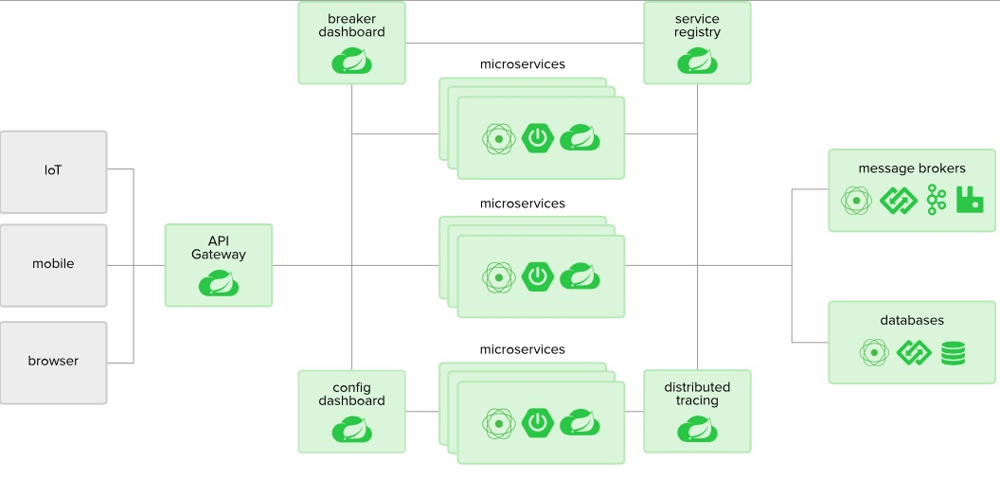
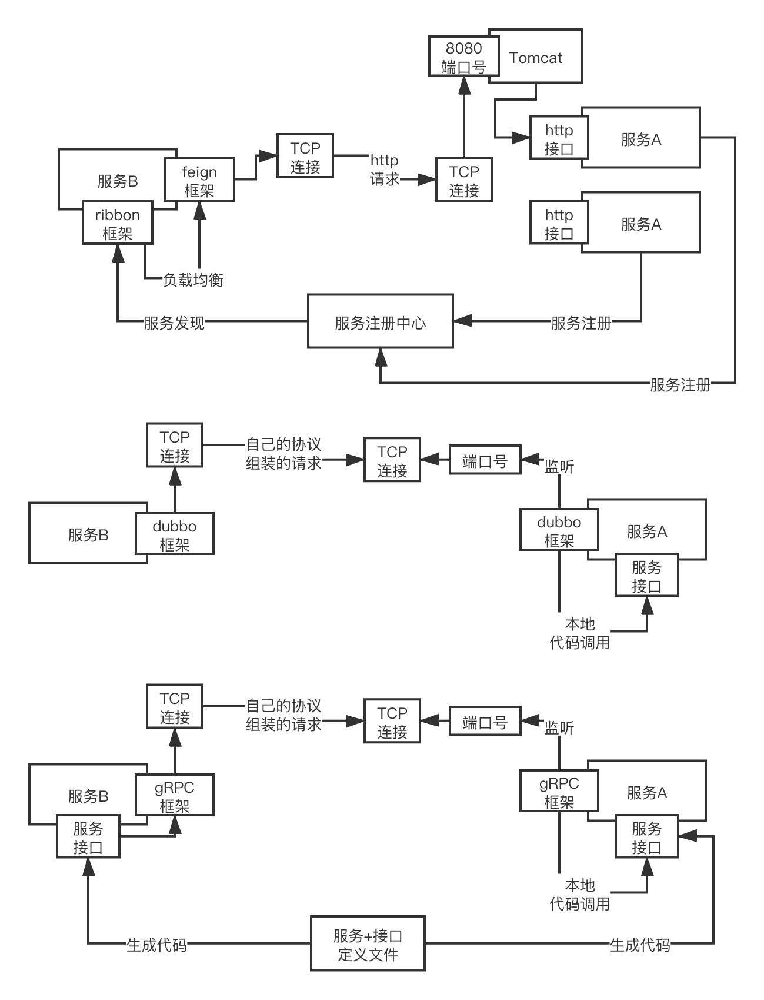
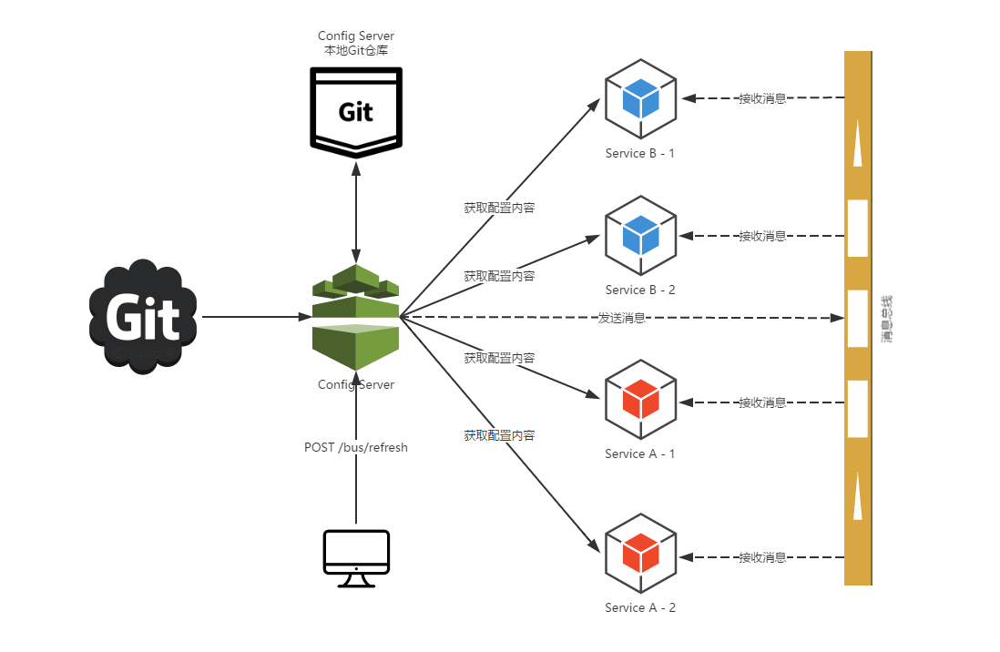
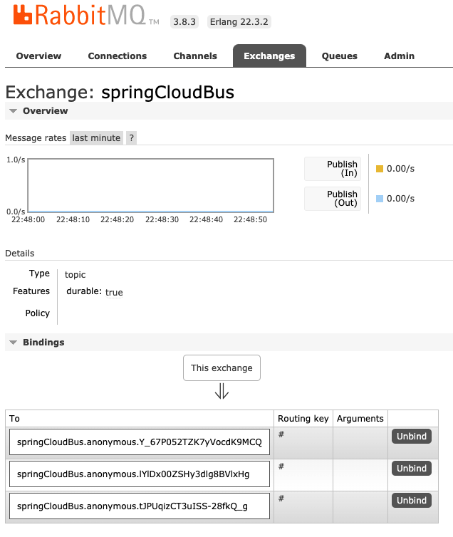
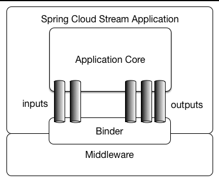
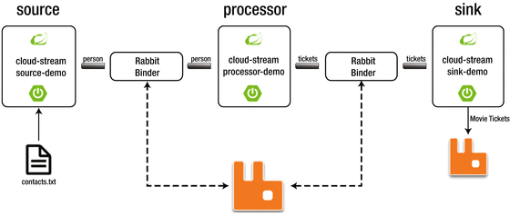
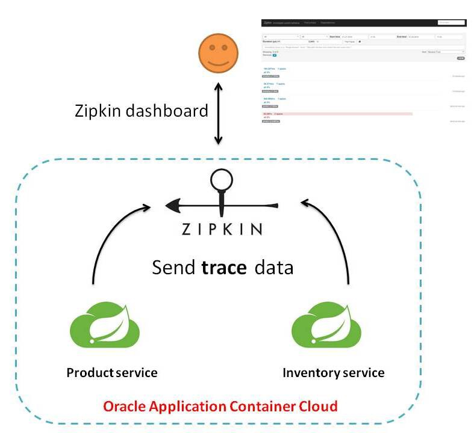
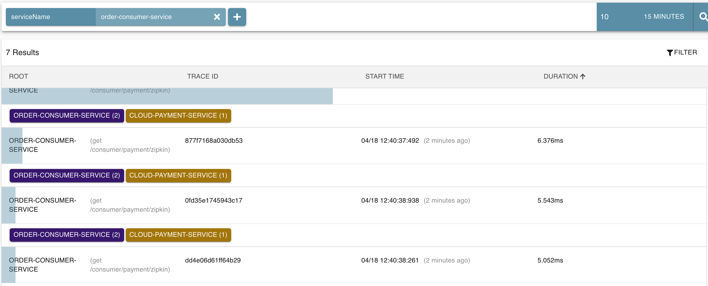

# Spring Cloud Netflix

## 1.Spring Cloud Overview

- micro service tech stack
- Eureka，Zuul in maintenance mode，Nacos including service registration and config
  

***

## 2. Project Structure

```groovy
subprojects {
    apply plugin: 'java'
    apply plugin: 'org.springframework.boot'
    apply plugin:'io.spring.dependency-management'

    sourceCompatibility = 1.8
    targetCompatibility = 1.8

    [compileJava,compileTestJava,javadoc]*.options*.encoding = 'UTF-8'
    repositories {
        mavenLocal()
        mavenCentral()
    }
    ext {
            springBootVersion = '2.2.6.RELEASE'
            springCloudAlibabaVersion = '2.1.0.RELEASE'
            springCloudVersion = 'Honton.SR1'
    }

    dependencies {
        implementation "org.springframework.boot:spring-boot-starter-web:$springBootVersion"
        implementation "org.springframework.cloud:spring-cloud-dependencies:$springCloudVersion"
        implementation "org.springframework.cloud:spring-cloud-alibaba-dependencies:$springCloudAlibabaVersion"
        annotationProcessor "org.springframework.boot:spring-boot-configuration-processor"
        implementation "org.mybatis.spring.boot:mybatis-spring-boot-starter:2.0.0"
        implementation "com.alibaba:druid:1.1.16"
        runtime "mysql:mysql-connector-java"
        implementation "log4j:log4j:1.2.17"
        testCompile "junit:junit:4.12"
        testCompile "org.springframework.boot:spring-boot-starter-test:$springBootVersion"
        compileOnly 'org.projectlombok:lombok'
        annotationProcessor 'org.projectlombok:lombok'
    }
}
```

***

## 3. RestTemplate

- spring wrapper http client to invoke remote restful
- passing url, parameter and return type
- configure RestTemplate

```java
@Configuration
public class ApplicationContextConfig {

    @Bean
    public RestTemplate getRestTemplate() {
        return new RestTemplate();
    }
}
```

- call RestTemplate for http call

```java
public class OrderController {
    public static final String PAYMENT_URL = "http://localhost:8001";
    @GetMapping("/consumer/payment/create")
    public CommonResult<Payment> create(Payment payment) {
        return restTemplate.postForObject(PAYMENT_URL + "/payment/create", payment, CommonResult.class);
    }
}
```

***


## 4. Common 

- abstract common code
- enable jar and maven
- reuse maven local repo to install to local

```groovy
plugins {
    id 'java'
    id 'maven'
}
jar.enabled = true

repositories {
    mavenLocal()
    mavenCentral()
}
```

- other project import module

```groovy
dependencies {
    implementation "com.bp:cloud-api-common:1.0"
    testCompile group: 'junit', name: 'junit', version: '4.12'
}
```


## 5. Service Discovery

#### Eureka

- client-server architecture with heart beat
- service provider cluster register to eureka server cluster
- service consumer get registry from eureka server cluster
- eureka server: provide registration service
- eureka client: register service, heart beat period is 30s, de-register client if no heart beat

##### server

+ configuration in buidl.gradle and application.yml
+ enable in main application

```groovy
implementation "org.springframework.cloud:spring-cloud-starter-netflix-eureka-server:2.2.1.RELEASE"
```

```yaml
eureka:
  instance:
    hostname: localhost
  client:
    # do not register self
    register-with-eureka: false
    # declare as register
    fetch-registry: false
    # url to qurey to lookup service
    service-url:
      defaultZone: http://${eureka.instance.hostname}:${server.port}/eureka
```

```java
@EnableEurekaServer
public class EurekaMain7001 { }
```

##### client

+ configuration, spring.application.name is service in registry
+ enable in main application

```groovy
implementation "org.springframework.cloud:spring-cloud-starter-netflix-eureka-client:2.2.1.RELEASE"
```

```yaml
eureka:
  client:
    register-with-eureka: true
    fetch-registry: true
    service-url:
      defaultZone: http://localhost:7001/eureka
```

```java
@EnableEurekaClient
public class PaymentMain8001 { }
```

##### cluster

+ eureka server register with each other
+ eureka client register to multiple eureka server
  + enable @LoadBalanced for RestTemplate
  + change the hostname to service name

```yaml
eureka:
  instance:
    hostname: eureka7001.com
  client:
    service-url:
      defaultZone: http://eureka7002.com:7002/eureka
```

```yaml
eureka:
  instance:
    hostname: eureka7002.com
  client:
    service-url:
      defaultZone: http://eureka7001.com:7001/eureka
```

```yaml
eureka:
  client:
    service-url:
      defaultZone: http://eureka7001.com:7001/eureka,http://eureka7002.com:7002/eureka
```

```java
@Configuration
public class ApplicationContextConfig {
    @Bean
    @LoadBalanced
    public RestTemplate getRestTemplate() {
        return new RestTemplate();
    }
}
public class OrderController {

    public static final String PAYMENT_URL = "http://CLOUD-PAYMENT-SERVICE";
    @GetMapping("/consumer/payment/create")
    public CommonResult<Payment> create(Payment payment) {
        return restTemplate.postForObject(PAYMENT_URL + "/payment/create", payment, CommonResult.class);
    }
}
```

- configure host and ip

```yaml
eureka:
    instance:
        instance-id: payment8001
        prefer-ip-address: true
```

- enable discovery client and discovery client get service info from eureka server

```java
@RestController
@Slf4j
public class PaymentController {

    @Resource
    private DiscoveryClient discoveryClient;

    @GetMapping(value = "/payment/discovery")
    public Object discovery() {
        List<String> serviceList = discoveryClient.getServices();
        serviceList.forEach(s -> log.info("service: " + s));

        List<ServiceInstance> instanceList = discoveryClient.getInstances("CLOUD-PAYMENT-SERVICE");
        instanceList.forEach(i -> log.info(i.getServiceId() + "\t" + i.getHost() + "\t" + i.getPort() + "\t" + i.getUri()));
        return this.discoveryClient;
    }
}

@EnableDiscoveryClient
public class PaymentMain8001 { }
```

##### self protection

+ if some service is unavailable, eureka will will keep in info, AP
+ configure in server and client

```yaml
eureka:
  server:
    # disable self-preservation
    enable-self-preservation: false
    eviction-interval-timer-in-ms: 2000
```

```yaml
eureka:
  instance:
    instance-id: payment8001
    prefer-ip-address: true
    # heat beat period (default is 30)
    lease-renewal-interval-in-seconds: 5
    # expiration after last success heart beat
    lease-expiration-duration-in-seconds: 10
```

#### Zookeeper

- start zookeeper: ./zkServer.sh start
- CP, temp node
- configure build.gradle

```
dependencies {
    compile('org.springframework.cloud:spring-cloud-starter-zookeeper-discovery:2.2.1.RELEASE')
    testCompile group: 'junit', name: 'junit', version: '4.12'
}
```

- get zookeeper service info

```shell script
[zk: localhost:2181(CONNECTED) 9] get /services/cloud-payment-service/ee014310-2356-4f46-b538-8bc113310b1e
{"name":"cloud-payment-service","id":"ee014310-2356-4f46-b538-8bc113310b1e","address":"192.168.1.102","port":8004,"sslPort":null,"payload":{"@class":"org.springframework.cloud.zookeeper.discovery.ZookeeperInstance","id":"application-1","name":"cloud-payment-service","metadata":{}},"registrationTimeUTC":1586946162725,"serviceType":"DYNAMIC","uriSpec":{"parts":[{"value":"scheme","variable":true},{"value":"://","variable":false},{"value":"address","variable":true},{"value":":","variable":false},{"value":"port","variable":true}]}}
```

```yaml
spring:
  application:
    name: cloud-payment-service
  cloud:
    zookeeper:
      connect-string: 127.0.0.1:2181
```

#### Consul

- service mesh solution providing a full featured control plane with service discovery
- HashiCorp develop via Golang
- could be service discovery, config centre, bus, web monitor
- run: ./consul agent -dev
- admin: http://localhost:8500/ui/dc1/services

```groovy
dependencies {
    compile 'org.springframework.cloud:spring-cloud-starter-consul-discovery:2.2.1.RELEASE'
}
```

```yaml
spring:
  application:
    name: consul-provider-payment
  cloud:
    consul:
      discovery:
        service-name: ${spring.application.name}
      port: 8500
      host: localhost
```

#### Eureka vs Zookeeper vs Consul

- Eureka: AP, java
- Consul: CP, go
- Zookeeper: CP, java
- Consistency, Availability, Partition tolerance

***

## 6. Ribbon

- client load balancing
- configuration timeout, retry
- maintenance mode, going to be replace by spring cloud loadbalancer
- local load balancer, get service from registry and cache in local
- eureka-client integrate with ribbon

#### RestTemplate

- getForObject/getForEntity, postForObject/postForEntity
- Object: json
- Entity: @ResponseEntity contains body, header, status code

#### Routing Policy

- RoundRobin: default
  + index of request % number of active server
  + nextServerCyclicCounter is index of request
  + allServers is number of active servers
  + operation: Atomic get value, newValue = (value + 1) mod allServer, compareAndSet(value, newValue)

```java
public class RoundRobinRule extends AbstractLoadBalancerRule {
    private int incrementAndGetModulo(int modulo) {
        for (;;) {
            int current = nextServerCyclicCounter.get();
            int next = (current + 1) % modulo;
            if (nextServerCyclicCounter.compareAndSet(current, next))
                return next;
        }
    }
}
```

- RandomRule
- RetryRule
- WeightedResponseTimeRule: weighted short response node
- BestAvailableRule
- AvailablityFilteringRule: filter failure node
- Configuration
  + package should not under @ComponentScan
  + otherwise all the ribbon client with shared same policy
  + Configuration Bean return IRule()
  + enable @RibbonClient(name = "CLOUD-PAYMENT-SERVICE", configuration = MyRule.class)

```java
@Configuration
public class MyRule{
    @Bean
    public IRule myRibbonRule() {
        return new RandomRule();
    }
}
@RibbonClient(name = "CLOUD-PAYMENT-SERVICE", configuration = MyRule.class)
public class OrderMain80 { }
```

***

## 7. OpenFeign

### RPC框架

#### 面向接口的远程调用

假设如果你没有RPC的框架，此时假如说你的每个服务对外暴露的接口，都是一些HTTP接口，http://21.38.254.306:8080/xx/xx?xx=xx，其他服务如果说要调用你的这个服务，就必须使用apache的http的组件，或者是JDK自带的http组件，构建出来一个HTTP请求，包括请求路径，请求头，请求体（JSON串过去）

好不容易构建出来一个完整的HTTP请求，通过http组件发送这个HTTP请求过去，在底层也是得跟那个服务的指定机器的指定端口号，也都是建立TCP连接，在TCP连接之上，发送HTTP协议组装出来的请求过去。接收人家给你的HTTP响应，解析HTTP响应，响应头，状态码（404，500），响应体（JSON串），极为麻烦

RPC这种东西，比如说你发布一个服务，主要就是定义了一些接口

``` JAVA
public interface ServcieA {
      public String hello(String name);

}
```

#### RPC选型



##### feign+ribbon

spring cloud netflix技术栈，RPC调用，用的就是feign框架+ribbon做负载均衡，暴露出来的服务接口，就是最平常的基于spring mvc写的controller暴露出来的一些http接口，定义一个http的url地址。 通过feign框架进行RPC调用：String result = serviceA.hello(name)

+ **按照http协议来组装你的请求数据**，数据格式都是按照http协议里的请求来做的
+ http请求还还必须做**一个序列化，序列化成二进制的字节流**
+ 通过底层的**tcp连接发送过去**

本质上服务A的部署是基于tomcat去进行部署的，tomcat会监听你指定的端口号，当别人要发送http请求给你的时候，首先必须跟tomcat建立tcp网络连接，发送http请求给tomcat，tomcat收到之后，解析出来这个http请求，交给你的spring mvc写的controller来进行处理

##### dubbo

dubbo自己使用的一套协议，自定义协议，也可以是别的协议，肯定不是http协议，去组装请求数据，然后做一个序列化，二进制字节数组或者是字节流，都可以，通过底层的网络连接把请求数据发送过去就可以了。在本地解析请求以后，调用ServiceA这个类里面的hello()这个方法，传入name这个参数，**获取result这个返回值，然后通过网络连接把响应数据按照自己的协议封装，序列化，通过网络连接发送给服务B就可以了**。

- declarative web service client
- underlying implementation is ribbon

### Configuration

```groovy
dependencies {
    implementation "org.springframework.cloud:spring-cloud-starter-netflix-eureka-client:2.2.1.RELEASE"
    implementation "com.bp:cloud-api-common:1.0"
    testCompile group: 'junit', name: 'junit', version: '4.12'
}
```

- enable feign

```java
@EnableFeignClients
public class OrderFeignMain80 { }
```

- config for timeout and logging by adding Logger.Level.Full into container

```yaml
ribbon:
  ReadTimeout: 5000
  ConnectTimeout: 5000
```

```java
@Configuration
public class FeignConfig {
    @Bean
    Logger.Level feignLoggerLevel() {
        return Logger.Level.FULL;
    }
}

```

- declare feign client and invoke feign client

```java
@Component
@FeignClient("CLOUD-PAYMENT-SERVICE")
public interface PaymentFeignService {
    @GetMapping(value = "/payment/get/{id}")
    public CommonResult<Payment> getPaymentById(@PathVariable("id") Long id);
}

@RestController
@Slf4j
public class OrderFeignController {

    @Resource
    private PaymentFeignService paymentFeignService;

    @GetMapping(value = "/consumer/payment/get/{id}")
    public CommonResult<Payment> getPaymentById(@PathVariable("id") Long id) {
        return paymentFeignService.getPaymentById(id);
    }
}
```

***

## 8. Hystrix

- latency and fault tolerance library
- isolate points of access to remote systems, services and 3rd party libraries
- stop cascading failure and enable resilience in complex distributed systems where failure is inevitable
- service
  + fallback
    + fallback service if remote service is unavailable
    + avoid full use of thread 
  + circuit break
    + reject request once meet full limit
  + flow limit
    + queue the request

#### Fallbacks Service

- timeout and runtime exception
- enable @EnableHystrix, provide fallback in controller layer
  + configure HystrixCommand's fallbackMethod = "paymentInfoTimeoutHandler"
  + configure HystrixProperty's execution.isolation.thread.timeoutInMillisecond property to set timeout
  + configure Global fallback method via @DefaultProperties

```java
@EnableHystrix
public class PaymentHystrixMain8001 { }

public class PaymentService { 
    @HystrixCommand(fallbackMethod = "paymentInfoTimeoutHandler", commandProperties = {
        @HystrixProperty(name="execution.isolation.thread.timeoutInMilliseconds",value="3000")
    })
    public String paymentInfoTimeout(Integer id) { }

    public String paymentInfoTimeoutHandler(Integer id) {
        return "Thread name: " + Thread.currentThread().getName() + " paymentInfoTimeoutHandler, id: "  + id;
    }
}

@DefaultProperties(defaultFallback = "paymentGlobalFallbackMethod")
public class OrderFeignController {

    @GetMapping("/consumer/payment/hystrix/ok/{id}")
    @HystrixCommand
    public String paymentInfoOK(@PathVariable("id") Integer id) {
        String result = paymentHystrixService.paymentInfoOK(id);
        return result;
    }

    public String paymentGlobalFallbackMethod() {
        return "Global Fallback";
    }
}
```

- enable @FeignClient(fallback), provide fallback in service layer
  + create fallback class
  + provide fallback in FeignClient

```java
@Component
public class PaymentFallbackService implements PaymentHystrixService{ }

@FeignClient(value = "CLOUD-PROVIDER-HYSTRIX-PAYMENT", fallback = PaymentFallbackService.class)
public interface PaymentHystrixService { }
```

#### Circuit Break

- fallback, circuit break, restore service
- happen service failure in limited period
- steps
  + open to close when overload
  + closed to half open for limit number of request
  + half open to open when service restore
- enable circuit break via circuitBreaker.enabled

```java
public class PaymentController { 
    @HystrixCommand(fallbackMethod = "paymentCircuitBreakerFallback",commandProperties = {
        @HystrixProperty(name = "circuitBreaker.enabled",value = "true"),
        // request limit in windows
        @HystrixProperty(name = "circuitBreaker.requestVolumeThreshold",value = "10"),
        // windows to calculate failure rate
        @HystrixProperty(name = "circuitBreaker.sleepWindowInMilliseconds",value = "10000"),
        // failure percentage
        @HystrixProperty(name = "circuitBreaker.errorThresholdPercentage",value = "60"),
    })
    public String paymentCircuitBreaker(@PathVariable("id") Integer id) {
        if(id < 0) {
            throw new RuntimeException("Id can not be negative");
        }
        String serialNumber = IdUtil.simpleUUID();
        return Thread.currentThread().getName()+"\t"+"success, serial number: " + serialNumber;
    }

    public String paymentCircuitBreakerFallback(@PathVariable("id") Integer id) {
        return "overload in circuit break " +id;
    }
}
```


- realtime monitor
  + enable hystrix dashboard
  + open dashboard address http://localhost:9001/hystrix
    + monitor address: http://localhost:8001/hystrix.stream
    + delay: 2000

```java
@EnableHystrixDashboard
public class HystrixDashboardMain9001 {
    public static void main(String[] args) {
        SpringApplication.run(HystrixDashboardMain9001.class, args);
    }
}
```

***

## 8. Cloud Gateway

- spring cloud gateway replace zuul
- based on webflux and reactor
- provide fallback, flow limit, circuit break

#### Zuul vs Gateway

- zuul 1.0 in maintenance mode, 2.0 is not production
- zuul 1.0 is blocking io, no support for websocket
- gateway integrate with spring cloud
  + dynamic routing: mapping id with URI
  + predicate: match URI
  + filter: redirect request to business controller
    + pre: parameter valuation, authorization, authentication, logging, flow monitor
    + post: modify response header, logging
  + integrate hystrix
    

#### Routing & Predicate

- exclude spring-boot-starter-web
- configure routing in yaml or source doe
- predicate: after, before, between, header, method, path, query, cookie
  + cookie, header: 1st arg is name, 2nd arg is regular expression

```groovy
configurations {
    all.collect { configuration ->
        configuration.exclude   group: 'org.springframework.boot', module: 'spring-boot-starter-web'
    }
}
```

```yaml
spring:
  application:
    name: cloud-gateway-service
  cloud:
    gateway:
      discovery: #enable load balancer
        locator:
          enabled: true
      routes:
        - id: payment_routh1 #payment_route   #routing id
#          uri: http://localhost:8001         #routing host
          uri: lb://CLOUD-PAYMENT-SERVICE     #routing to service
          predicates:
            - Path=/payment/get/**            #predicate to match uri

        - id: payment_routh2 #payment_route     #routing id
#          uri: http://localhost:8001           #routing host
          uri: lb://CLOUD-PAYMENT-SERVICE       #routing to service
          predicates:
            - Path=/payment/lb/**        # predicate to match uri
            - Cookie=username,myname
            # - After=2020-05-21T15:51:37.485+08:00[Asia/Shanghai]
            #- Header=X-Request-Id, \d+  #
```

```java
@Configuration
public class GateWayConfig {
    @Bean
    public RouteLocator customRouteLocator(RouteLocatorBuilder routeLocatorBuilder) {

        RouteLocatorBuilder.Builder routes = routeLocatorBuilder.routes();
        routes.route("path_route_baidu",
            r -> r.path("/guonei").uri("http://news.baidu.com/guonei")).build();

        return routes.build();
    }
}
```

#### Filter

- configure in routing or global
- configure custom configuration

```java
@Component
@Slf4j
public class MyLogGateWayFilter implements GlobalFilter, Ordered {

    @Override
    public Mono<Void> filter(ServerWebExchange exchange, GatewayFilterChain chain) {
        log.info("Global Filter: " + LocalDate.now());

        String username = exchange.getRequest().getQueryParams().getFirst("username");
        if (StringUtils.isEmpty(username)) {
            log.info("unauthorized access");
            //set http status code and response immediately
            exchange.getResponse().setStatusCode(HttpStatus.NOT_ACCEPTABLE);
            return exchange.getResponse().setComplete();
        }
        return chain.filter(exchange);
    }
}
```

***

## 9. Cloud Configure

- provide central configuration centre
- bind different env to  different configure and dynamic configuration distribution

#### Github rules

- {label}/{application}-{profile}.yml, recommended
- {application}-{profile}.yml
- {application}/{profile}/{label}

#### Server Configure

+ import spring-cloud-config-server library
+ enable @EnableConfigServer

```groovy
dependencies {
    implementation "org.springframework.cloud:spring-cloud-starter-netflix-eureka-client:2.2.1.RELEASE"
    implementation "org.springframework.cloud:spring-cloud-config-server:2.2.1.RELEASE"
}
```

```java
@SpringBootApplication
@EnableConfigServer
public class ConfigCenterMain3344 { }
```

#### Client Configure

- application.yml: user level
- bootstrap: system level, parent of ApplicationContext
- import library and create bootstrap.xml

```groovy
dependencies {
    implementation "org.springframework.cloud:spring-cloud-starter-netflix-eureka-client:2.2.1.RELEASE"
    implementation "org.springframework.cloud:spring-cloud-starter-config:2.2.1.RELEASE"
    implementation "com.bp:cloud-api-common:1.0"
    testCompile group: 'junit', name: 'junit', version: '4.12'
}
```

```yaml
spring:
  application:
    name: config-client
  cloud:
    config:
      label: master 
      name: config 
      profile: dev 
      uri: http://config-3344.com:3344
```

- expose /actuator/refresh interface
- manual refresh: "curl -X POST http://${host}:${post}/actuator/refresh"
- controller add @RefreshScope

```yaml
management:
  endpoints:
    web:
      exposure:
        include: "*"
```

```java
@RefreshScope
public class ConfigClientController {
    @Value("${config.info}")
    private String configInfo;
}
```

***

## 10. Cloud Bus

- support rabbitMQ, kafka
- lightweight message broker publish message, client subscribe topic
- refresh config server, config server publish config to client
  

#### Configure in Server

- start up rabbit mq server
- import cloud bus library
- configure rabbit mq and expose bus-refresh interface
- publish configure
  + global: POST http://localhost:3344/actuator/bus-refresh
  + single: POST http://localhost:3344/actuator/bus-refresh/${application}:${port}

```groovy
dependencies {
    implementation "org.springframework.cloud:spring-cloud-starter-netflix-eureka-client:2.2.1.RELEASE"
    implementation "org.springframework.cloud:spring-cloud-starter-bus-amqp:2.2.1.RELEASE"
}

```

```yaml
spring:
  rabbitmq:
    host: localhost
    port: 5672
    username: guest
    password: guest

management:
  endpoints:
    web:
      exposure:
        include: 'bus-refresh'
```

#### Configure in Client

- import cloud bus library
- configure rabbit mq and expose bus-refresh interface

```groovy
dependencies {
    implementation "org.springframework.cloud:spring-cloud-starter-netflix-eureka-client:2.2.1.RELEASE"
    implementation "org.springframework.cloud:spring-cloud-starter-bus-amqp:2.2.1.RELEASE"
}
```

```yaml
spring:
  rabbitmq:
    host: localhost
    port: 5672
    username: guest
    password: guest
```



***

## 11. Stream

- many mq product in market
- ignore mq implementation, adapter for all mq
- framework for building highly scalable event-driven microservices connected with shared messaging systems
- define the binder to decouple mq broker difference and application
- binder implementation: RabbitMQ, Apache Kafka, Kafka Stream, Amazon Kinesis
- component
  + Middleware
  + Binder
  + @Input: accept message into app
  + @Output: send message out app
  + @StreamListener
  + @EnableBinder
    
    

#### Configure in Server

- import org.springframework.cloud:spring-cloud-starter-stream-rabbit library
- configure binder and binding
  + binders.defaultRabbit is name for mq configure, can be any name
  + bindings.output.destination is topic name
  + @EnableBinding(Source.class) in service to send message

```yaml
spring:
  application:
    name: cloud-stream-consumer
  cloud:
    stream:
      binders: # define binder；
        defaultRabbit: # name
          type: rabbit  # binding to Rabbit
          environment: # rabbitmq environment
            spring:
              rabbitmq:
                host: localhost
                port: 5672
                username: guest
                password: guest
      bindings: # define binding relationship
        output: # channel
          destination: studyExchange # exchange name
          content-type: application/json # message type
          binder: defaultRabbit
```

```groovy
dependencies {
    implementation "org.springframework.cloud:spring-cloud-starter-netflix-eureka-client"
    implementation "org.springframework.cloud:spring-cloud-config-server"
    implementation "org.springframework.cloud:spring-cloud-starter-stream-rabbit"
    testCompile group: 'junit', name: 'junit', version: '4.12'
}
```

```java
@EnableBinding(Source.class)
public class MessageProviderImpl implements IMessageProvider {

    @Resource
    private MessageChannel output;

    @Override
    public String send() {
        String serial = UUID.randomUUID().toString();
        output.send(MessageBuilder.withPayload(serial).build());
        return null;
    }
}

```

#### Configure in Client

- import org.springframework.cloud:spring-cloud-starter-stream-rabbit library
- configure binder and binding
  + @EnableBinding(Source.class) in service to send message
- grouping
  - consumer will consume duplicated message if consumer are in different group
  - assign the consumer in same group to avoid the duplication message consumption via bindings.input.group
- persistent
  - consumer without group no persistence
  - consumer with group will persist message

```yaml
spring:
  application:
    name: cloud-stream-rabbitmq-provider
  cloud:
    stream:
      binders: # define binder；
        defaultRabbit: # name
          type: rabbit  # binding to Rabbit
          environment: # rabbitmq environment
            spring:
              rabbitmq:
                host: localhost
                port: 5672
                username: guest
                password: guest
      bindings: # define binding relationship
        input: # channel
          destination: studyExchange # exchange name
          content-type: application/json # message type
          binder: defaultRabbit
          group: groupSG
```

```groovy
dependencies {
    implementation "org.springframework.cloud:spring-cloud-starter-netflix-eureka-client"
    implementation "org.springframework.cloud:spring-cloud-config-server"
    implementation "org.springframework.cloud:spring-cloud-starter-stream-rabbit"
    testCompile group: 'junit', name: 'junit', version: '4.12'
}
```

```java
@Component
@EnableBinding(Sink.class)
public class MessageListenerController {

    @Value("${server.port}")
    private String serverPort;

    @StreamListener(Sink.INPUT)
    public void input(Message<String> message) {
        System.out.println("received: " + message.getPayload());
    }
}
```

***

## 12. Sleuth + Zipkin

- distributed tracing solution for Spring Cloud, borrowing heavily from Dapper, Zipkin and HTrace
- sleuth: collection of data
- zipkin: present data
  

**zipkin**

- java -jar zipkin.jar
- tracing by tracing id, one request have same trace id and different span id for different service
  
- configure in client

```yaml
spring:
  application:
    name: cloud-payment-service
  zipkin:
    base-url: http://localhost:9411
  sleuth:
    sampler:
      probability: 1
```

- console: http://localhost:9411/
  

***

## 